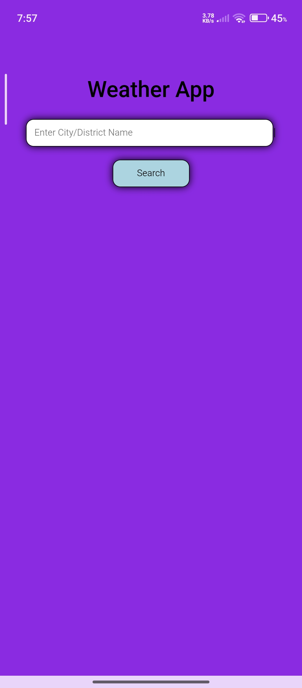
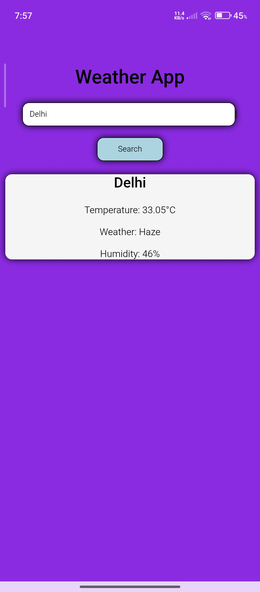

# 🌦️ Weather App

A simple Weather Application built using **HTML, CSS, and JavaScript**. This application fetches and displays real-time weather information for any city using a weather API.

## 🚀 Features

* Search weather by city name
* Display temperature in Celsius
* Display weather condition
* Display humidity
* Clean and simple user interface
* Responsive design

## 🛠️ Technologies Used

* HTML5
* CSS3
* JavaScript (ES6)
* Weather API
* Kotlin (Android WebView Wrapper)

## 📱 Android Version

This web application has been converted into an Android APK using **Kotlin WebView**.

## ▶️ How to Run

1. Download or clone the repository.
2. Open `index.html` in your browser.
3. Enter a city name.
4. Click the Search button.
5. View the weather information.

## 📸 Screenshot

## 🔮 Future Improvements

* Weather icons
* 5-day forecast
* Dark mode
* GPS location support
* Better UI/UX

## 👨‍💻 Author

Gopal Kr. Pandit

## 📄 License

This project is created for learning and educational purposes.
